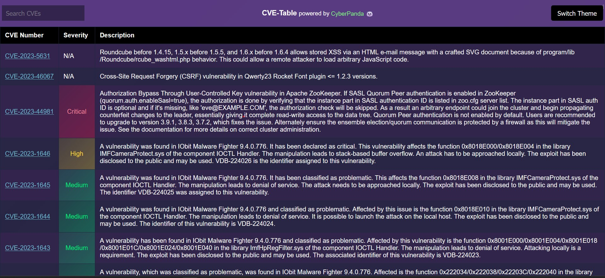
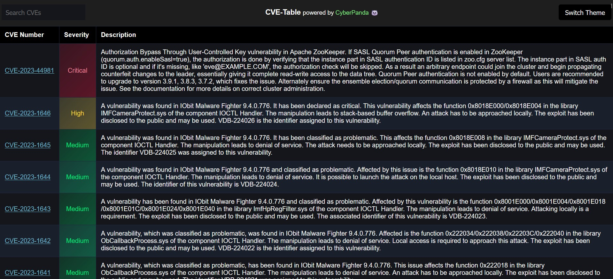
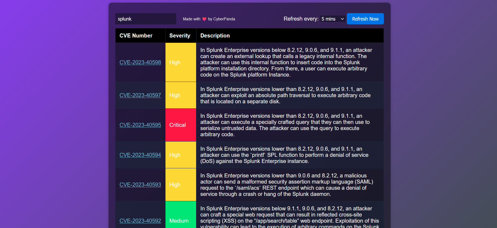
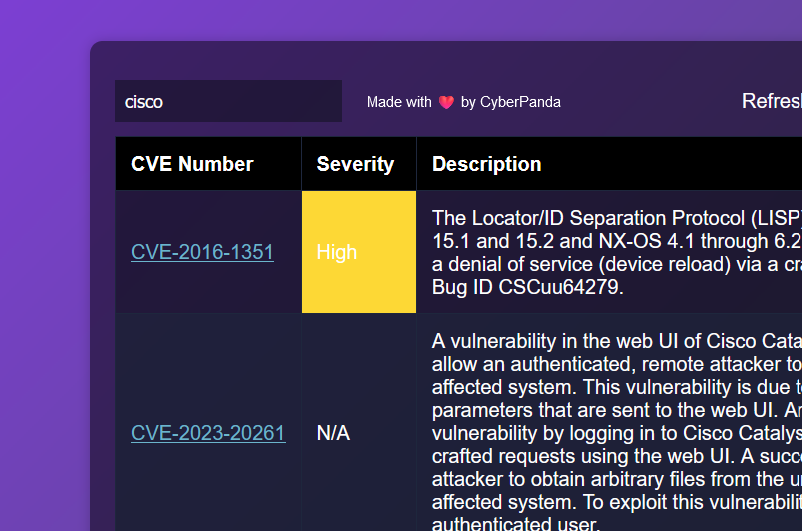

# CVE Table - Your quick CVE Information Resource
powered by [Cyber Panda](https://x.com/realcyberpanda) 🐼

CVE-Table is your go-to resource for quickly finding information about Common Vulnerabilities and Exposures (CVEs). With a user-friendly interface, it allows you to search for product names, companies, specific strings like "XSS," or even entire CVE IDs. The website provides you with a convenient summary of the CVE, along with hyperlinks to relevant references.

### -> [DEMO](https://cyberpanda.github.io/)
> Feel free to remove the powered by CyberPanda tag in your fork if you don't want it. I'm fine with it!

**Key Features:**

- **Quick Lookup:** Easily find information on CVEs by entering product names, company names, strings, or complete CVE IDs.

- **Comprehensive Summaries:** Get detailed information and descriptions of the CVEs you search for.

- **Hyperlinked References:** Access a curated list of references related to the CVE, making it easy to further explore and understand the security issue.

## Changelog:

- Fix CSS Issue#2, add Semi-Darkmode, redesign a bit.
- Add Color Palette
New "Themes":
Purple, Dark, Pink, Rose, Lemon, Mint

### Regular Mode

### Dark Mode

### Old Preview:

